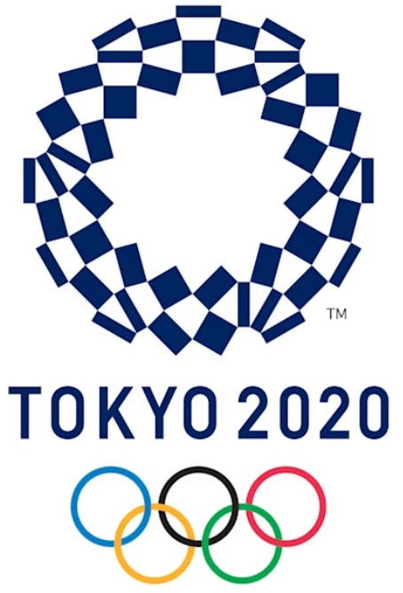
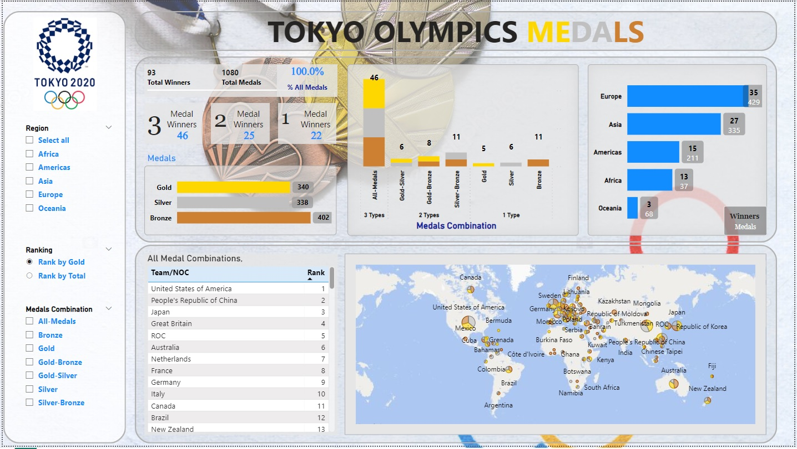

# TOKYO OLYMPICS

## Mahmoud Mohamed Abdel Aziz

## Data Cleaning and Preprocessing

**Deliverables**: Cleaned dataset ready for analysis.

### Data Files:
1. **Tokyo Olympic Data.xlsx**
   - **Medals Data**:
     - Removed unnecessary rows and promoted headers.
     - Trimmed text and changed data types.
     - Kept relevant columns: "Team/NOC", "Gold", "Silver", "Bronze".
     - Created new columns for medal winners by type and new combinations.
     - Unpivoted medal columns for better filtering.
     - Removed rows where the number of medals was zero.
   - **Medals Ranking**:
     - Created a table with columns "Rank", "Team/NOC", "Total", "Rank by Total".
     - Renamed "Rank" to "Rank by Gold" for clarity (ranked by gold, silver, then bronze).
     - Unpivoted the ranking data to be used as slicers in the dashboard.

2. **Country-region-table.xlsx**
   - Compiled manually using data from the "Country-region-all" sheet.
   - Corrected country names for mapping purposes (e.g., "Great Britain" to "United Kingdom").
   - Ensured the dataset had no errors and was ready for use in Power BI.

### ERD (Entity Relationship Diagram):

## Analysis Questions Phase

**Deliverables**: Set of questions that the data can answer.

### Key Analysis Questions:
- Totals of all medals and winners.
- Distribution of medal types and combinations.
- Medal distribution by region and country.
- Ranking teams based on gold or total medals.

## Dashboard Phase

**Deliverables**: Completed Power BI dashboard.

### Key Features:
- **Totalizers and Medal Distribution**: Visualize the distribution of medals over winners and medal types.
- **Percentage Calculation**: Show percentages for total medals and each medal type when slicers are applied.
- **Ranking Tables**: Display rankings based on either gold or total medals.
- **Map Visualization**: Use a map to display medal distribution by country/region.

## Next Steps and Possible Enhancements:
- Further refine the dashboard by adding additional filters for deeper analysis.
- Investigate the possibility of integrating other Olympic datasets (e.g., athlete data).
