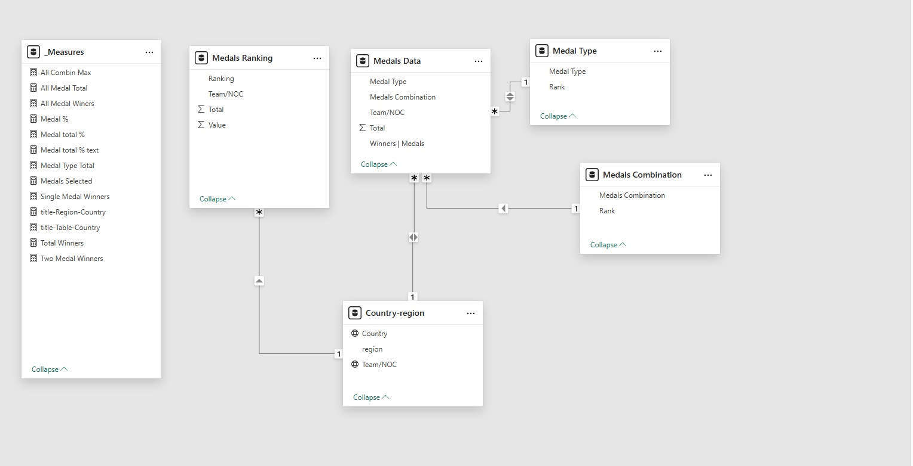

| \[30/12/2024\] |
|----------------|

| TOKYO OLYMPICS |
|--------------------------------|

 Mahmoud Mohamed Abdel Aziz

 

# Data Cleaning and Preprocessing

Data Preprocessing: Clean and preprocess the data using Power BI

**Deliverables:** Cleaned dataset ready for analysis.

## **Steps** 

> The data consists of 1 Tables of Medals data "Tokyo Olympic Data.xlsx"
> Downloaded Countries names and Regions from internet "Country-region-table.xlsx"

**Tokyo Olympic Data.xlsx**
> **Medals Data**
> * Primary Work, Open Load, Remove unnecessary Rows, and Promte the header
> * Trimmed Text and Change data Type
> * Keeps Only required Columns "Team/NOC", "Gold", "Silver", "Bronze"
> * Created new columns for Winners depending on Medals Type they won
> * Created new Column for Medals Combinations
> * Unpivot Gold, Silver, and Bronze Columns to Make them good for filtering
> * Remove Data when number of Medals is Zero
> * Confirmed by data view NO Errors and NO Empty data
>
> **Medals Ranking**
> * This is a copy of Medals Data Table but using Columns Removed before in this new Table
> * Keep Columns "Rank", "Team/NOC", "Total", "Rank by Total"
> * Renamed Rank to be Rank by Gold to remove missunderstanding,By search, I know Rank depend primarily on Gold, if equal check Silver, if equal Check Bronze
> * Unpivot the Two Ranking Ways to be used as Slicer in Dashboard
> * Confirmed by data view NO Errors and NO Empty data

**Country-region-table.xlsx**

> * Created this Excel Sheet by using Country-region-all sheet in temporary PowerBI file and
>     * Created table Visual by Team/NOC from Tokyo Olympic Data and Country & Region From this Sheet
>     * Get a table with all Region except about 6 coutries. They are done manually using ChatGPT
>     * Now All Data are Avaiable and put them in this File
> *  Using the data in Maps and do Some Manual check for countries.
>     * All of them is OK Except Great Britain. So,
>     * created new Country Column To Keep original name but use United Kingdom name the Map can understand
> *  Confirmed by data view NO Errors and NO Empty data

**Ranking Tables**
> * **Medal Type** Created Manual Table to Rank Gold - Silver - Bronze
> *  **Medals Combination** Created Manual Table to Rank Gold combination - Silver combination - Bronze

**ERD (Entity Relationship Diagram)**
 

# Analysis Questions Phase

Determine Data Analysis Questions: Determine all possible analysis
questions that can be deducted from the given dataset and would be of
interest to the organization's decision makers.

**Deliverables:** Set of analysis questions that can be answered via the
dataset.

## **Steps** 

**All Available Data**

> * Medals Data Numner and Type for Each Country
> * All possible Medal Combinations and Type as created in Medal Type and Medals Combination Tables
> * Check Medal distribution over Countries and Regions

**Qustions to investigate**
> * Totals of All Medals, All Winners
> * Distribution of Winners (Winning All Medal Type, winning Two Types, or winning only one Type)
> * Above Combination is detailed more to all posible combination
> * Distribution of Number of Medals over region
> * Distribution of Number of Medals over Medal Type
> * Table for Ranking Teams depending on Gold or Total Medals

# Dashboard Phase

Build Dashboard: Build a Power BI dashboard that visualize the answers
to the asked questions.

**Deliverables:** Power BI dashboard.

## **Steps** 

> * Started The Story Telling by Totalizer and Medals Distribution
>   * Over Winner (3 Medals, 2 Medals, 1 Medal)
>   * Over Medal Type (Gold, Silver, Bronze)
> * Pecentage of Total Medals and Pecent of Each medal Type When Left-Side Slicer is used:
>   * Slicer for Medal Type
>   * Slicer for Medal Cobination
>   * Slicer for Region
> * Table for Ranking Teams based on Two Ranking Option above it:
>   * Rank by Gold Medals
>   * Rank by Total Medals
> * Map Layout for Medal Distibution depend on Type and Number of Medals

 
 

